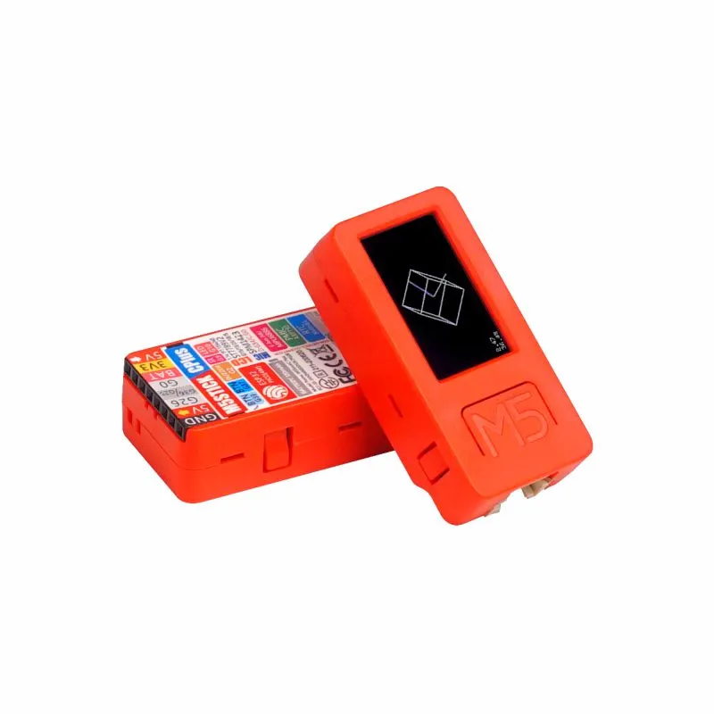

# My M5StickcPlus config

Trying to create a config for my M5StickcPlus without arduino, rust only with no_std. This project needs A LOT of dependencies, I advise for anyone to learn more about [esp-rs](https://docs.esp-rs.org/book/).

## M5StickcPlus

I am using the official manual of the M5StickcPlus, you can find it [here](https://cdn.competec.ch/documents2/8/5/9/185624958/185624958.pdf).

